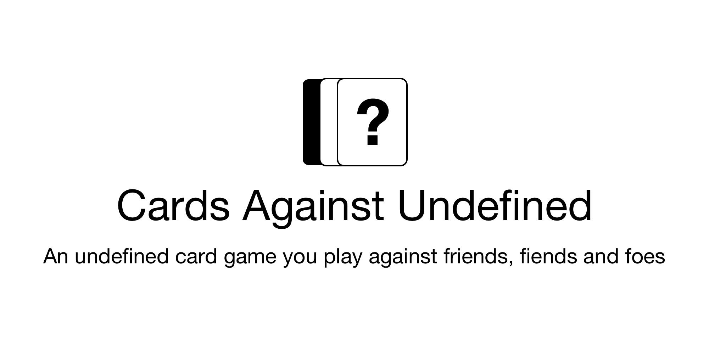
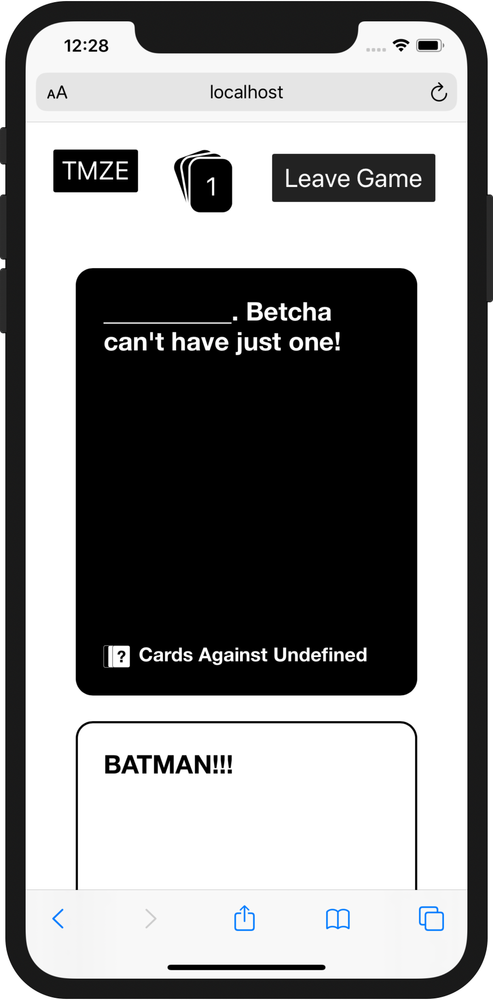
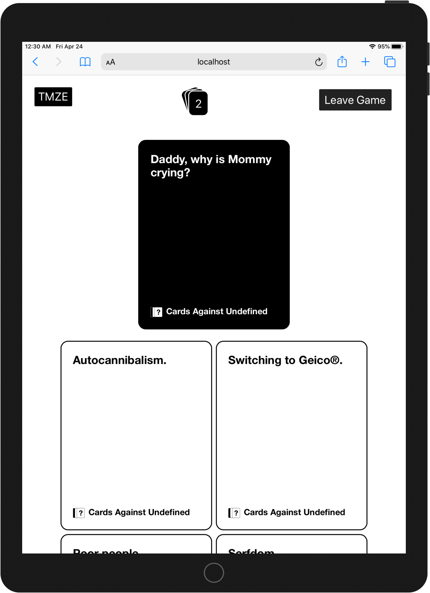

# 

> An undefined card game you play against friends, fiends and foes

## Features

-   👨‍💻 Play online with as many humans that you can handle
-   👺 People can watch you make dumb selections in audience mode
-   🃏 Supports customs decks
-   🖐 Supports Pick ❶❷❸ cards
-   📱 Can be played on desktop and mobile devices
-   ♻️ Accidental refresh protection _(don't want you to get kicked out of the game)_
-   ⚛️ Uses React! _(probably shouldn't be a feature)_

## Screenshots

 

## Setup

One click install via Heroku:

## License

Cards Against Humanity is distributed under [Creative Commons BY-NC-SA 2.0 license](https://creativecommons.org/licenses/by-nc-sa/2.0/) as is this project.
